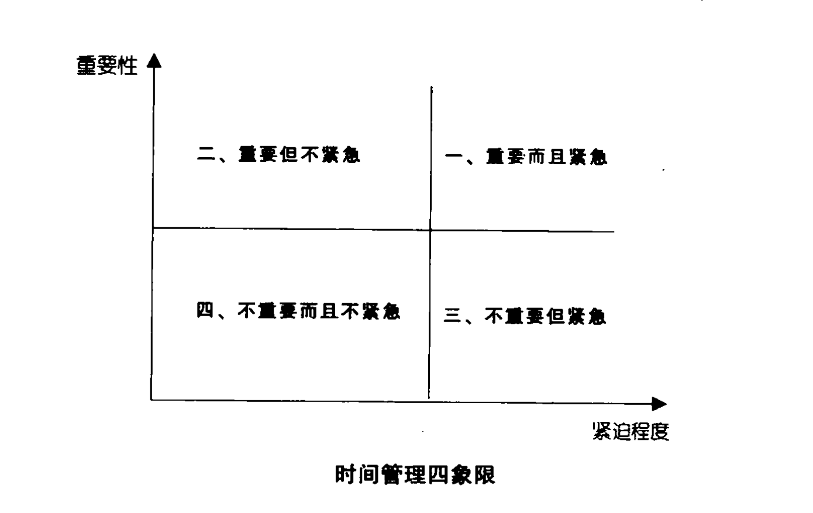
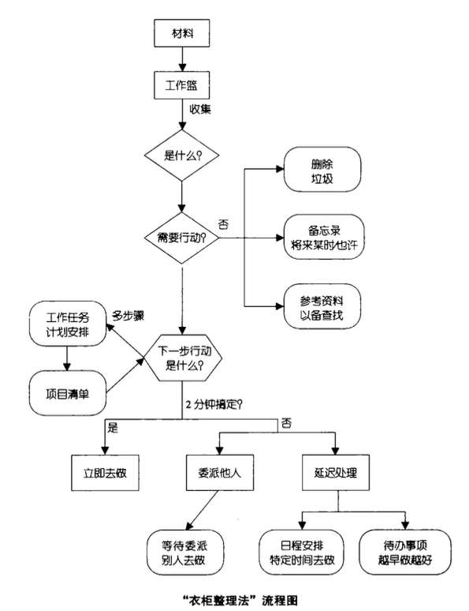
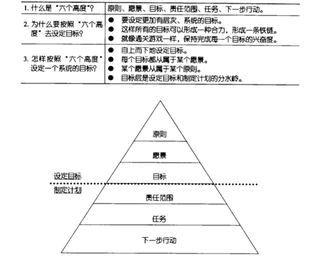
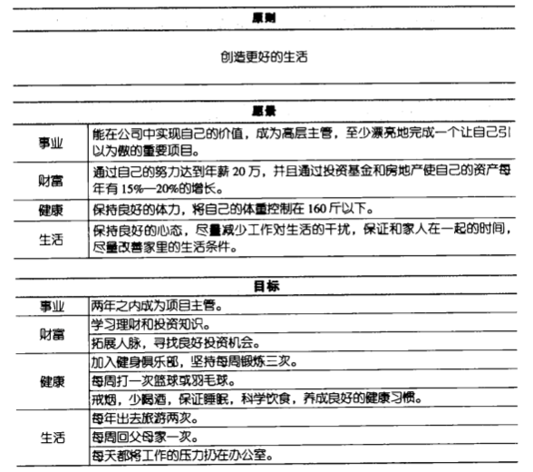

---

layout: ribbon

style: |

    #Cover h2 {
        margin:30px 0 0;
        color:#FFF;
        text-align:center;
        font-size:70px;
        }
    #Cover p {
        margin:10px 0 0;
        text-align:center;
        color:#FFF;
        font-style:italic;
        font-size:20px;
        }
        #Cover p a {
            color:#FFF;
            }
    #End h2 {
        color:#FFF;
        }
    #SeeMore h2 {
        font-size:100px
        }
    #SeeMore img {
        width:0.72em;
        height:0.72em;
        }
---

# 时间管理 {#Cover}

*更好的工作*

*更好的生活*

<!-- photo by John Carey, fiftyfootshadows.net -->

## 时间都去哪儿了？

1. 集中精力工作
2. 真正的休息
3. 碎片化时间
4. 无意义浪费时间
5. 时间黑洞
6. 建立时间日志来检查：找出高效时间段

## 避开时间黑洞

1. 关掉所有聊天工具QQ/WeChat/钉钉；彻底关闭
2. 关闭邮件客户端提醒和其他一切软件的提醒功能
3. 确保水和工作所需物品触手可及
4. 尽量隔离自己，避免同事打扰
5. 打开自己的TODO-List
6. 分轻重缓急处理事项
7. 设置任务的最后期限

## 时间管理四象限(1/2)

 

## 时间管理四象限(2/2)

第一象限： 立即去做！主要压力来源，进入次数越少越好
第二象限： 有计划去做  时间应投资于第二象限；会大大减少第一象限的事情
第三象限： 委婉拒绝或交给别人去做
第四象限： 尽量别做  缓冲调整区，做多等于浪费生命

## **应用『猴子法则』走出第三象限**

## 时间管理三大杀手

* 拖延
* 犹豫不决
* 目标不明确

## 

## 

## 

## 

## 
* 一段时间内集中精力做一件事情
* 转化项目为具体行动
* 收集篮（backlog） -》将来/也许、TODO、项目+行动

## 参考

* 小强升职记
* 番茄土豆 https://pomotodo.com/

## 开始实践

{:.cover .shout #End}

<!-- photo by John Carey, fiftyfootshadows.net -->
